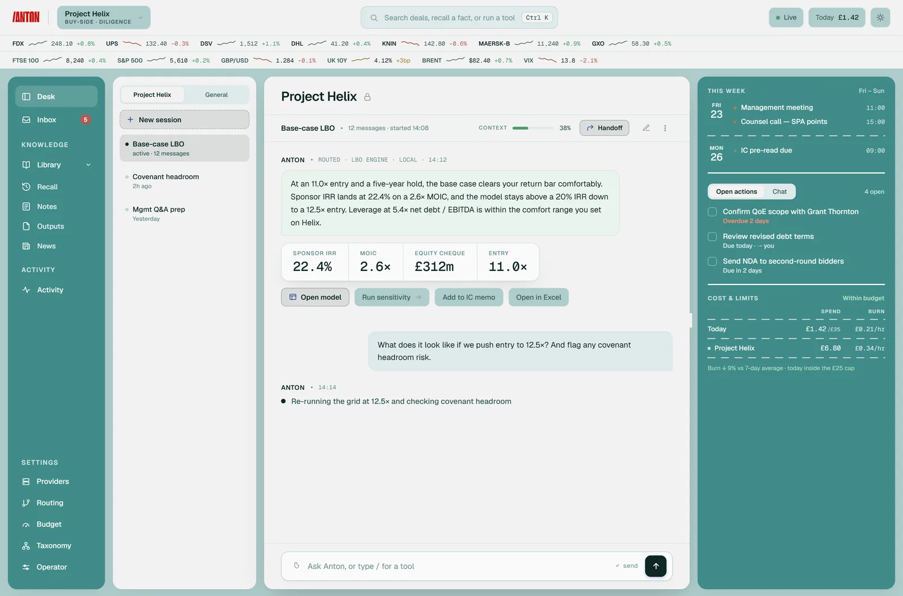
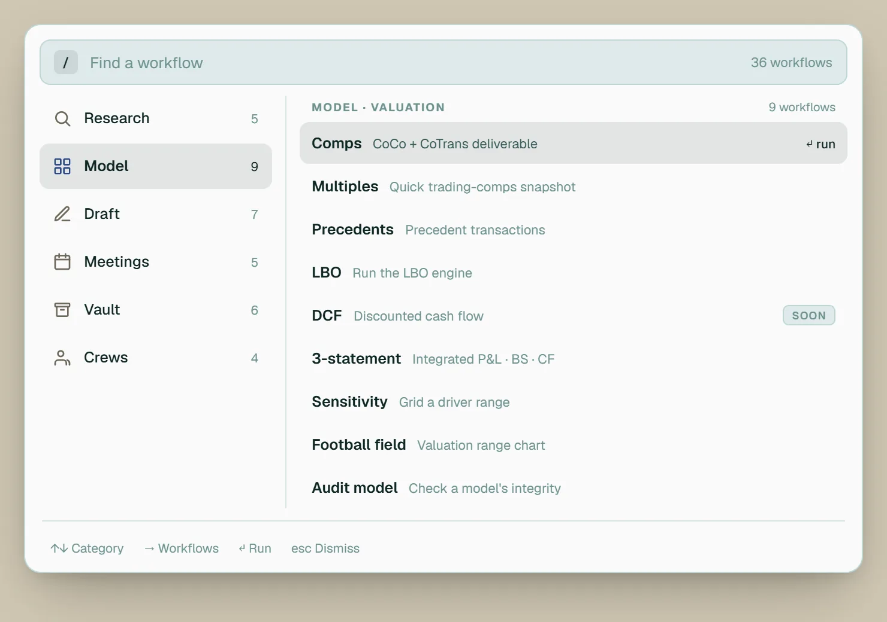
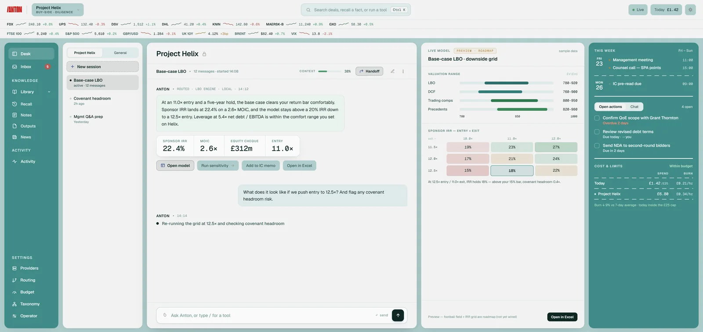
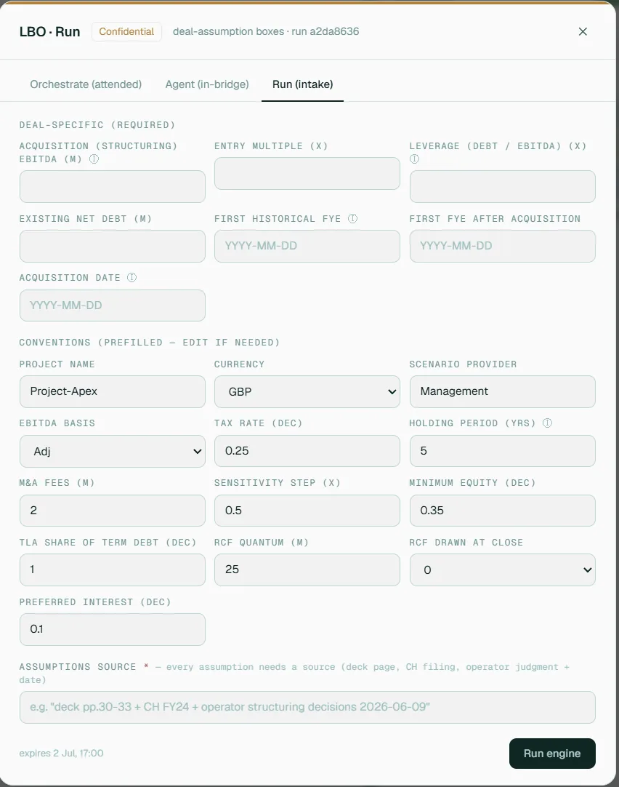
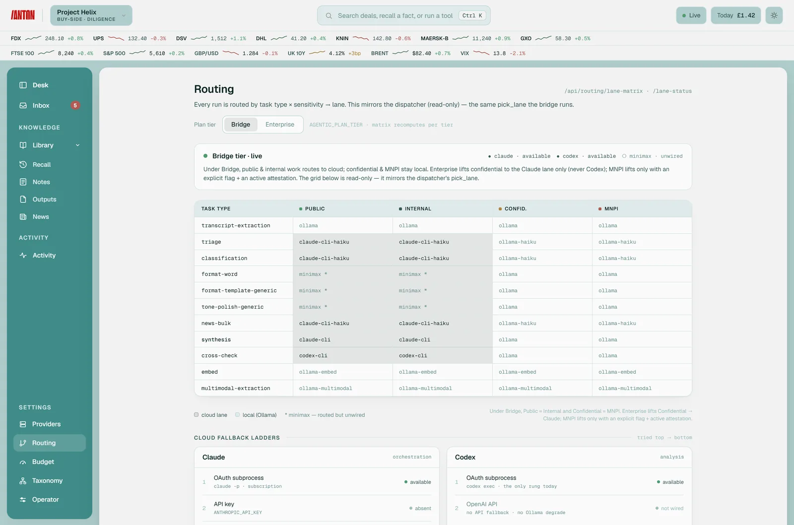
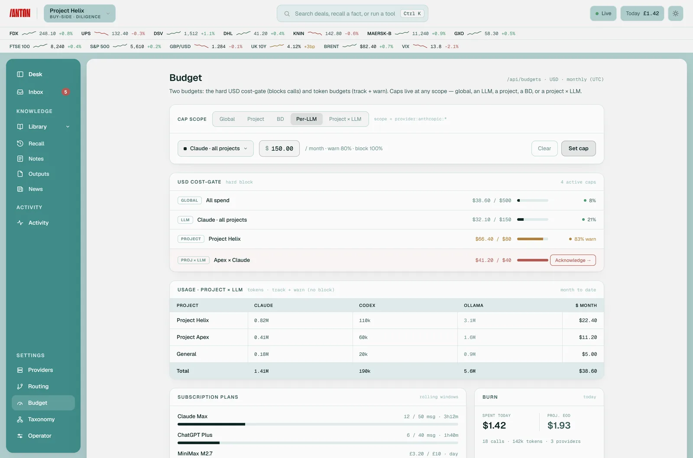
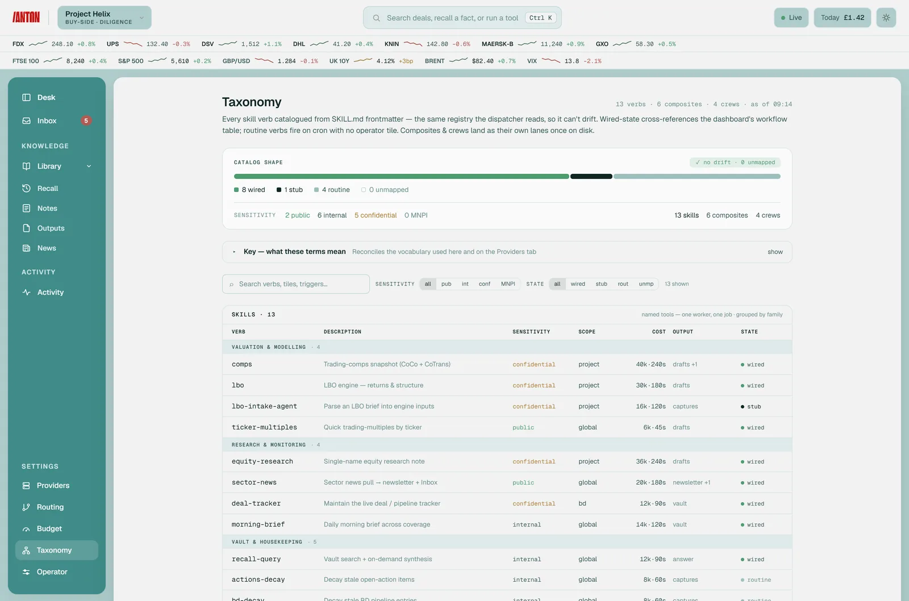
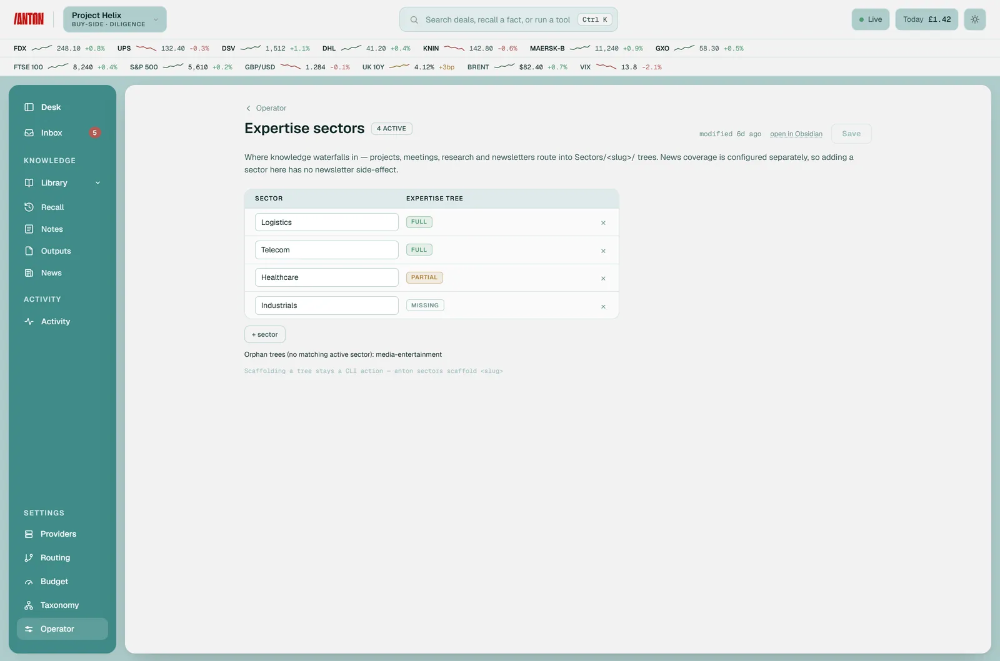
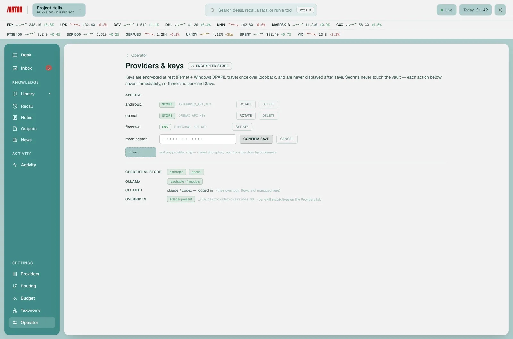
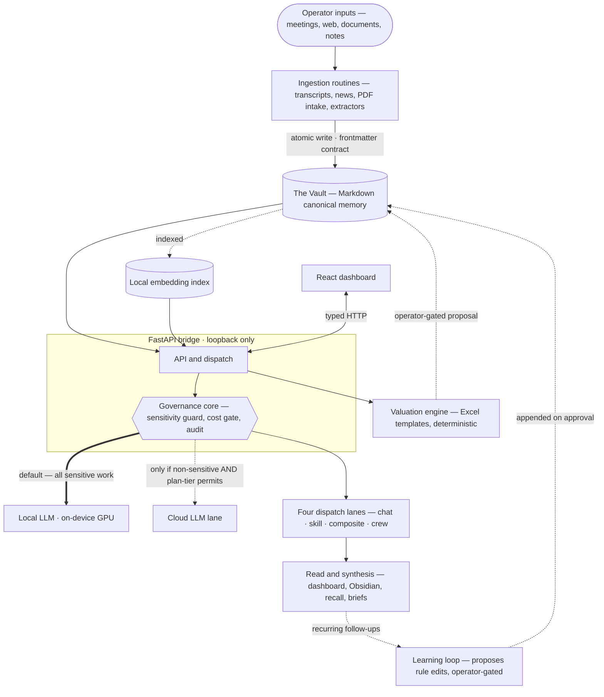

<div align="center">


### Operator-led AI harness designed for M&A and investment professionals

Designed to reduce the two biggest operational risks in AI-assisted dealmaking: data leakage and mathematical hallucinations

LLMs analyze CIMs, VDR docs, and NDAs to route information and draft investment committee narratives, while a deterministic Python engine strictly executes your LBO and DCF modelling

Vault structured as a second brain, consolidating information across Outlook, news, meeting notes and projects. Available on demand to prepare agendas, track DD and draft deal materials

Crucially, strict data governance ensures your highly confidential deal materials remain confidential\*

<sub>\* Data confidentiality is maintained by running sensitive documents on local LLMs or enterprise subscription models by default</sub>


</div>

> **Shared for review, testing, and feedback.** This is a public mirror of a working,
> single‑operator private system. It is opinionated, unfinished in places, and carries no
> support SLA. Issues and PRs are welcome — see [`CONTRIBUTING.md`](CONTRIBUTING.md).

---

## What it is

ANTON turns an Obsidian‑style **Markdown vault** into a queryable knowledge base and wires it to
a **deterministic valuation engine**, an **automation layer** of scheduled routines, and a **React
dashboard** — all behind a single FastAPI "bridge" that enforces one rule above all others:

> **Sensitivity decides where a model may run, and the decision is made _before_ the call.**

Most "AI for finance" tools are a chat box in front of a cloud model. ANTON is the opposite
instinct: **an operator‑led LLM OS for M&A and investment professionals, designed to work alongside you — with auditability, control, and professional judgement at the centre.** The maths
is reproducible, the routing is centralised and fail‑closed, every write to memory is gated by
the operator, and every model call leaves a structured trail.

---

## Why it's different

| Issue | Generic AI Platforms | ANTON |
|---|---|---|
| **Valuation Engine** | **Black-Box Computations:** Relies on non-deterministic LLMs to calculate figures, leading to frequent mathematical hallucinations and broken dynamic formulas. | **Deterministic Execution:** Zero numbers are computed by the LLM. Financial modeling tasks shell out to a native Python engine that drives versioned Excel templates (LBO, DCF, Comps) cell-by-cell. |
| **Data Confidentiality** | **Opaque Cloud Risk:** Relies on generic cloud privacy policies; high operational risk of leaking sensitive Virtual Data Room (VDR) contents or deal parameters. | **Structurally Enforced Local Isolation:** Governed by a strict sensitivity guard mapping files into four distinct tiers. `Confidential` and `MNPI` data tiers default to a local-only GPU, ensuring data never leaves the machine. |
| **Execution Governance** | **Unchecked Background Swarms:** Opaque agentic loops execute hundreds of hidden background calls, generating highly unpredictable, non-repeatable outputs. | **Four Explicit Processing Lanes:** The operator selects the exact lane (Chat, Single Skill, Composite, or Autonomous Crew) via specific verbs, dictating hard token ceilings and explicit determinism boundaries. |
| **Budget Control** | **Unmonitored Runaway Costs:** Opaque architectures lack granular tracking, risking surprise API credit card overruns during intensive deal sprints. | **Granular Token Budgeting:** Features strict monthly budget caps that can be configured globally, per individual model, or mapped directly to a specific deal project with proactive friction warnings. |
| **Memory Governance** | **Silent Database Overwrites:** Automatically appends unverified data or vector embeddings to a shared database, creating unvouched facts and corrupting deal history. | **Principal-Gated Knowledge Base:** Waterfall knowledge structure on a per project > per sector > expert essence, feeding from all available sources. System conclusions are delivered purely as isolated proposals. Fact updates to your permanent Markdown vault require explicit operator sign-off—never overwritten, never silent. |
| **Institutional Audit Trail** | **Opaque Operations:** Opaque systems offer zero underlying insight into why a model arrived at a particular conclusion, making validation impossible. | **Comprehensive Telemetry:** Every routine run and model call generates a structured, queryable trail through a sanitize-then-redact pipeline, logging provider, model, token cost, sensitivity tier, and execution lane. |
| **Continuous Optimization** | **Static Prompt Architectures:** Requires manual, complex prompt engineering or expensive code-level adjustments to align with changing workflow preferences. | **Heuristic Feedback Loops:** Actively monitors recurring follow-up query patterns to cluster behaviors and propose concrete, version-controlled modifications to its own underlying templates and operating rules. |

---

## See it in action

The single-operator cockpit over a Markdown vault — the same deal flows through every lane, with the sensitivity guard and audit trail wired through for institutional compliance. *(Shown with synthetic demo content.)*

### The cockpit



**Chat-first command surface.** A clean composer over the deal's sessions — live markets, the week ahead, the project rail, and real-time token spend. Interrogate deal docs or search the vault in plain language.



**One keystroke opens the palette.** The full dealmaker's toolkit — target screening, valuation, management meetings, and transaction materials (teasers, CIMs, IC memos) — each a governed skill you fire with a click or a slash-command.

### Valuation — the engine does the maths



**The model, live beside the chat.** Run the base case and stress the downside grid in place — IRR and covenant headroom across entry multiples and leverage — while the conversation stays in context.



**Governed intake, not a black box.** The operator approves inputs and assumptions — each one carrying a source — and a deterministic Python engine drives the Excel model cell-by-cell. No LLM ever computes a number.

### Confidentiality-aware routing & budgets



**The guard, made legible.** Per-skill and per-crew model assignment, the cloud-fallback ladder, and MNPI attestations — confidentiality-aware routing you can actually see.



**Token budgets and caps.** Set monthly caps globally, per project, or per model; usage tracks against the cap and warns before it bites — the hard cost block is separate.

### Governance, taxonomy & operator



**Every skill carries a sensitivity.** The taxonomy maps each skill and routine to a tier and an allowed lane — the rules the guard enforces, gathered in one place.



**Tuned to one operator.** Expertise sectors, watchlists, and news coverage that shape what ANTON drafts and tracks — all editable without opening Obsidian.



**Keys stay encrypted and local.** Provider credentials are encrypted at rest (Fernet + Windows DPAPI), entered once over loopback, and never displayed after save — secrets never touch the vault.

---

## Architecture

Five layers that meet only over the filesystem, HTTP, or a subprocess — **never by importing each
other.** That boundary discipline is the spine of the design: it keeps the maths auditable, the
sensitive data contained, and the heavy engines swappable.



**The hero of that diagram is the `Governance core`.** It is a single `before_llm_call` hook
registered once at startup — not a per‑route check. _Every_ lane (a single skill, a step inside a
composite, every role inside a crew) passes through it. Even a legacy skill with no declared
sensitivity gets a fail‑closed fallback. That one chokepoint is what lets ANTON make a hard
guarantee instead of a soft promise.

| Layer | What it is |
|---|---|
| **`vault/`** | Plain‑Markdown canonical memory. Every note, decision, and source is a `.md` file with mandatory YAML frontmatter. Git‑managed. No database, no SaaS lock‑in — the file _is_ the record. (Only a generic **skeleton** ships here; real content never leaves the private system.) |
| **`routines/`** | The FastAPI **bridge** — the only layer that touches everything. ~111 loopback endpoints, the sessions store, the scheduler, the encrypted credentials vault, telemetry, and the governance core. Serves the dashboard in production. |
| **`engine/`** | The **valuation engine**. A Python wrapper that drives versioned Excel templates (DCF / LBO / comps / 3‑statement …) through a cell‑map registry. Code computes and self‑checks; the model only picks inputs and narrates. |
| **`dashboard/`** | A React + TypeScript + Vite cockpit: chat shell, workflow tiles, an inbox of pending proposals, burn‑rate and routing panels. |
| **sidecar engines** | Two heavier orchestration runtimes kept deliberately out‑of‑process — a **composite** engine for declarative multi‑step DAGs (HTTP) and an **autonomous crew** engine for multi‑role agents (subprocess). Reached only across a boundary, never vendored in. |

---

## The four‑lane dispatch model

Every request runs through **exactly one** lane, and **you choose it by verb** — a tile click or a
slash‑command. No LLM classifier guesses. Crossing a lane boundary changes four things at once —
cost, latency, determinism, and audit shape — so the operator opts in knowingly.

| Lane | You trigger it with | Engine | Determinism | Typical latency | LLM calls |
|---|---|---|---|---|---|
| **Chat** | typing in the composer | one model call | high | 2–10 s | 1 |
| **Single skill** | a tile / `/recall` `/comps` `/lbo` … | bridge route → engine | **total** | 3–30 s | 0–1 |
| **Composite** | `/pitch` `/teaser` `/ic-memo` | declarative DAG (HTTP) | **total** — fixed topology | minutes | per‑step, declared |
| **Autonomous crew** | `/triage` `/explore` `/debate` `/digest` | multi‑role agents (subprocess) | **emergent** | minutes | tens–hundreds |

Each verb carries a hard token and wall‑clock ceiling; overflow returns a partial result and a
cost‑cap error rather than silently spending more.

---

## Sensitivity model

Every note carries a `sensitivity:` tier. The guard maps tier → allowed lane **before** dispatch,
and always defaults to the _more_ restrictive lane when uncertain.

| Tier | Examples | Where reasoning may run |
|---|---|---|
| `public` | Listed‑co financials, press releases, sector stats | Any cloud lane |
| `internal` | Your own analysis on public material; no party names | Cloud frontier model (consumer tier today; enterprise + ZDR later) |
| `confidential` | Deal codenames, target/buyer names, NDA contents, VDR docs | **Local on‑device model only** (until an enterprise + ZDR agreement is active) |
| `MNPI` | Pre‑announcement results, embargoed regulatory news, inside information | **Local only, in every phase.** Never leaves the machine. |

MNPI is treated as _categorically_ different from merely‑sensitive data: it is **regulated**, so
the local‑only floor is structural and fail‑closed — data‑protection guarantees alone don't
address the regulatory dimension. The whole local‑vs‑cloud posture flips on a single
`AGENTIC_PLAN_TIER` environment variable, decided in exactly one routing module that the guard
re‑checks server‑side.

---

## What's built today

Single-operator, local-first, and genuinely in use — a work in progress, shared for review. Honest about what's live and what isn't.

**Live today**
- **Three of the four lanes** — chat, single skills, and 4 autonomous crews running.
- **~111 endpoints** across 49 router files; **3,871 tests** across 249 files.
- **Overnight automations** — briefings, trackers, sector reads.
- **LBO end-to-end** through the engine, captured back to the vault as a gated proposal.
- **Valuation comparables** — Anton will understand target and identify comparable transactions and listed companies & provide strategic rationale for operator's approval.
- Per-task routing, operator override windows, budget gating, per-provider ceilings.

**In Progress**
- **Buyer tracking & NDA** — pending skill to track buyer engagement from email and batch personalised draft NDAs (Python engine, not LLM).
- **Composite lane** — composite actions (pitch, teaser, IC paper).
- **DCF** — blocked on per-template engine authoring.
- **Outlook & calendar ingestion** — pending Microsoft Graph app registration.
- **Cross-machine deploy** — local-first by design; no managed service.
- **HoT & SPA review** — implement skill to draft Heads of Terms (based on learnings & expertise) and review SPA.

→ Full, current detail in [`docs/OVERVIEW.md`](docs/OVERVIEW.md). A visual tour lives at
[`docs/index.html`](docs/index.html) (best served via GitHub Pages).

---

## Quickstart

> Windows is the primary target — the engine uses `xlwings` to drive Excel, and the launchers are
> PowerShell. The bridge and most routines are cross‑platform Python. Local reasoning needs
> [Ollama](https://ollama.com) and an NVIDIA GPU (≈12 GB VRAM recommended).

```powershell
# 1. Clone
git clone https://github.com/antonaios/anton.git && cd anton

# 2. One-shot install — venv + bridge + engine + dashboard build + a scaffolded vault
#    (directory tree, templates, and a starter profile / firm / .env).
powershell -ExecutionPolicy Bypass -File scripts\install.ps1 -VaultPath C:\anton-vault
#    add -WithExtras to also install the [markets] / [learning] / [recall] groups.

# 3. (optional) local reasoning — install Ollama, then pull the models
ollama pull qwen3:14b ; ollama pull qwen3:8b ; ollama pull nomic-embed-text

# 4. Launch — serves the bridge + built dashboard
powershell -ExecutionPolicy Bypass -File scripts\start-agentic-os.ps1
```

Open **http://127.0.0.1:8765/**. Set who's operating it by editing
`C:\anton-vault\_claude\profile.md`; add any API keys to the `.env` the installer wrote.

> **macOS / Linux** (no PowerShell autostart yet): `python -m venv .venv && . .venv/bin/activate`,
> then `pip install -e routines -e engine`, `cd dashboard && npm install && npm run build`, copy the
> `vault/` skeleton to your vault path, and run with `AGENTIC_VAULT=<path>
> AGENTIC_DASHBOARD_MODE=production python -m routines.api.app`.

---

## Repository layout

```
routines/    FastAPI bridge — HTTP + CLI core, routines, skills, scheduler, the sensitivity guard
dashboard/   React + TypeScript + Vite cockpit that talks to the bridge over HTTP
engine/      Python valuation engine — Excel-template wrapper (xlwings); no LLM computes a number
vault/       The Obsidian vault SKELETON — templates, a project scaffold, the operating constitution
scripts/     install.ps1, portable start/stop launchers, and scaffold-vault.ps1
templates/   Corporate-finance deal-folder structure (copy per deal)
docs/        Public overview + an interactive visual tour
```

---

## What it won't do — by design

These are hard rules in the operating constitution (`vault/CLAUDE.md`), not preferences:

- **No LLM does the maths.** Every figure traces to an engine run, a public source, or a sourced register entry.
- **No raw, pre‑embargo MNPI to any cloud lane** — ever, regardless of vendor protections.
- **No invented sources, citations, or quotes.** If it can't be traced, it's flagged, not asserted.
- **No overwriting a note** without explicit confirmation; memory is curated, append‑only, and dated.
- **Safe deletion only** — reversible operations, never `rm -rf` inside the vault.

---

## Scope and licensing

This mirror contains the platform's **code + a vault skeleton only**. It contains **no** real vault
content (companies, people, deals, notes), **no** secrets (`.env.example` ships variable _names_
with placeholder values), and does not vendor the optional external engines or the AGPL OpenBB
SDK. See [`THIRD-PARTY-NOTICES.md`](THIRD-PARTY-NOTICES.md).

Licensed **MIT** (see [`LICENSE`](LICENSE)). Security issues → [`SECURITY.md`](SECURITY.md) (please
don't open public issues for vulnerabilities).
